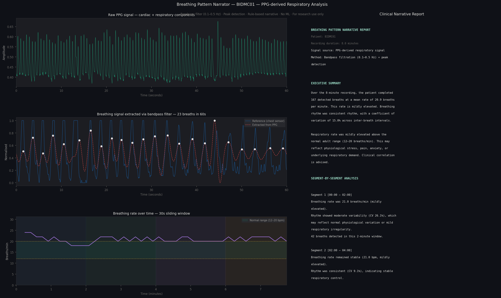

# Breathing Pattern Narrator
### PPG-Derived Respiratory Analysis with Rule-Based Clinical Narrative Generation

> Extracts breathing patterns from a PPG waveform using a bandpass filter,
> detects individual breaths, computes clinical features, and generates a
> structured plain-English respiratory report — no machine learning used.

**For research use only. Not validated for clinical use.**

---

## Demo



*Left: raw PPG, extracted breathing signal, and breathing rate over time.
Right: auto-generated clinical report with segment analysis and episode alerts.*

---

## What This Project Does

A PPG signal (the same waveform captured by any smartwatch) contains a slow
oscillation caused by breathing — your chest moving changes blood volume
slightly with every breath. This project isolates that oscillation using a
zero-phase Butterworth bandpass filter, detects individual breaths via
peak detection, computes clinical features, and translates the numbers into
a structured plain-English report using pure rule-based logic.

No neural networks. No training data. No ML frameworks.
Just signal processing and physiological understanding.

---

## Pipeline

Raw PPG signal (125 Hz)
↓
Butterworth bandpass filter (0.1–0.5 Hz)
↓
Breathing signal extracted
↓
Peak detection → individual breath timestamps
↓
Feature computation:

Breathing rate (breaths/min)
Inter-breath interval (mean, std, CV)
Segment-by-segment analysis
Episode detection (tachypnea / bradypnea)
↓
Rule-based narrative engine
↓
Plain-English clinical report + signal plots

---

## Results — Patient BIDMC01

| Metric | Value |
|--------|-------|
| Recording duration | 8 minutes |
| Total breaths detected | 167 |
| Mean breathing rate | 20.9 breaths/min |
| Inter-breath interval | 2.87s (± 0.43s) |
| Coefficient of variation | 15.0% |
| Correlation with reference | 0.496 (lag-corrected) |
| Breathing pattern | Mildly elevated, consistent rhythm |

> Note: correlation with the reference chest-sensor signal is moderate,
> consistent with known PPG-derived respiration literature. Lag correction
> (±2s search) found negligible timing offset (-0.07s), confirming this
> reflects genuine physiological difference in signal character rather
> than misalignment or detection error. See `docs/methods.md` for detail.

## Validation Across Multiple Patients

To assess generalizability beyond a single recording, the pipeline was run
on 5 patients from the BIDMC dataset without any per-patient tuning.

| Patient | Correlation (lag-corrected) | Best lag |
|---------|------------------------------|----------|
| BIDMC01 | 0.496 | -0.07s |
| BIDMC02 | 0.719 | -0.32s |
| BIDMC03 | 0.428 | 0.31s |
| BIDMC04 | 0.638 | 0.34s |
| BIDMC05 | 0.737 | 0.14s |
| **Mean ± SD** | **0.60 ± 0.12** | — |

> Correlation varies meaningfully across patients (0.43–0.74), which is
> expected: PPG-derived respiration quality depends on factors like probe
> placement, perfusion, and motion — the same limitation applies to any
> PPG-based respiratory monitoring approach, not just this pipeline. No
> per-patient parameter tuning was applied; all patients used identical
> filter and detection settings.
---

## Tech Stack

| Component | Tool |
|-----------|------|
| Data loading | wfdb (PhysioNet) |
| Signal processing | NumPy, SciPy |
| Filtering | Butterworth bandpass (scipy.signal) |
| Peak detection | scipy.signal.find_peaks |
| Visualisation | Matplotlib |
| Narrative engine | Pure Python rule-based logic |

---

## Project Structure

```
breathing-narrator/
├── src/
│   ├── load_data.py      # load BIDMC PhysioNet records
│   ├── dsp.py             # bandpass filter, breath detection, validation
│   ├── features.py        # segment analysis, episode detection, stats
│   ├── narrator.py        # rule-based narrative generation
│   └── visualise.py       # combined signal + narrative figure
├── output/                # saved plots and narrative text files
├── docs/
│   └── methods.md         # clinical methods and signal processing notes
├── requirements.txt
└── README.md
```
---

## How to Run

```bash
git clone https://github.com/Divyanshi101101101/BioScribe--breathing-narrator
cd breathing-narrator
python3 -m venv venv && source venv/bin/activate
pip install -r requirements.txt

# download dataset
python3 -c "import wfdb; wfdb.dl_database('bidmc', dl_dir='data/raw/')"

# run full pipeline
python3 src/visualise.py
```

---

## Dataset

BIDMC PPG and Respiration Dataset — PhysioNet
Pimentel et al., Towards a Robust Estimation of Respiratory Rate
from Pulse Oximeters, IEEE TBME, 2016.

---

## Clinical Methods

See `docs/methods.md` for full explanation of:
- Respiratory modulation of PPG
- Butterworth filter design and parameter selection
- Peak detection parameter justification
- Validation methodology
- Known limitations

---

*Built to demonstrate that deep physiological understanding combined with
basic DSP fundamentals can produce clinically interpretable outputs from
a single wearable sensor signal — without machine learning.*
